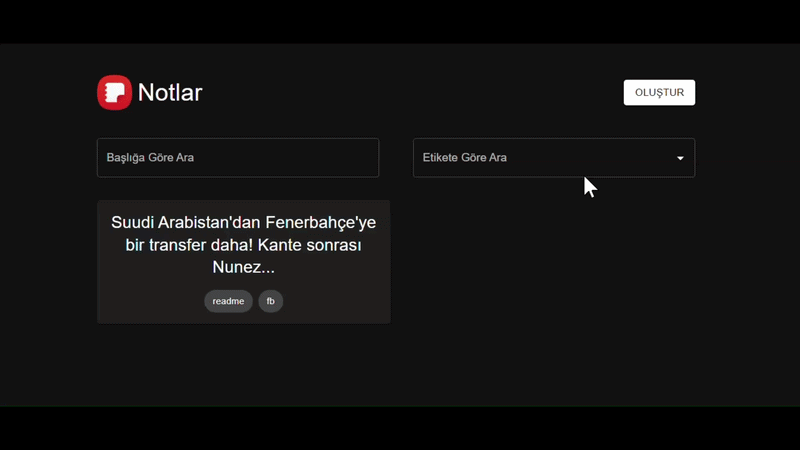

📝 Note-App: TypeScript & Redux Toolkit ile Zengin Metin Yönetimi
Modern web teknolojileriyle geliştirilmiş, kullanıcı dostu ve yüksek performanslı bir not alma uygulaması. Bu proje, karmaşık state süreçlerini ve tip güvenliğini ön planda tutan bir mimariyle inşa edilmiştir.

🎥




Bu proje, **React + TypeScript + Redux Toolkit** kullanılarak geliştirilmiş bir not alma uygulamasıdır.
Kullanıcılar not ekleyebilir, düzenleyebilir, silebilir ve etiketler ile notlarını organize edebilir.

---

## 🚀 Özellikler

- ➕ Not ekleme
- ✏️ Not düzenleme
- 🗑️ Not silme
- 🏷️ Etiket ekleme / silme
- 🧠 Redux Toolkit ile global state yönetimi
- 📝 Markdown destekli not içeriği
- 📱 Responsive tasarım (MUI)

---

## 🛠️ Kullanılan Teknolojiler

- React
- TypeScript
- Redux Toolkit
- React Router v6
- Material UI (MUI)
- UUID
- React Markdown

---

# ▶️ Kurulum ve Çalıştırma
```bash
git clone https://github.com/HasanEROL1/Note-App
cd notes-app
npm install
npm run dev
```
# Note-App
